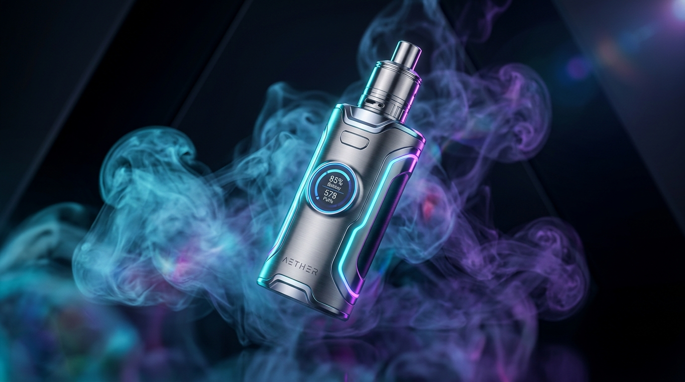

# AURA VAPOR LABS - Luxury Vape & E-Liquid Storefront

A modern, responsive, front-end demo storefront for a premium vape and flavor e-liquid brand featuring smart disposable vapes, refillable pod systems, replacement pod cartridges, and bottles of handcrafted e-liquids.



## 🚀 Features

- **Interactive Ambient Vapor Canvas**: Pure HTML5 Canvas particle system rendering ethereal smoke/vapor clouds that react to mouse movements and touch gestures.
- **21+ Age Verification Gate**: Glassmorphic compliance modal with "Remember Me" preference stored in `localStorage`.
- **Sensory Flavor Explorer**: Real-time filters and visual taste attribute bars (Sweetness, Coolness/Ice, Throat Hit) across fruity, icy, and dessert-tobacco profiles.
- **Product Catalog with Dynamic Filtering**: Search bar, category filters, and sorting by price or customer rating.
- **Quick View Modal**: In-depth technical specification sheet (puff count, coil Ω, battery capacity) and variant/nicotine strength selectors.
- **Slide-Out Cart Drawer**:
  - Live item quantity steppers (+/-)
  - Free shipping progress bar ($50 threshold)
  - Promo code redemption (`AURA20` for 20% off)
  - Simulated express checkout modal with order confirmation toast
- **Fully Responsive**: Optimized for desktop, tablet, and mobile with animated hamburger navigation and touch-swipable filter chips.

## 📁 Project Structure

```
├── index.html              # Main storefront HTML5 structure
├── .gitignore              # Git ignore rules
├── README.md               # Project documentation
└── assets/
    ├── css/
    │   ├── style.css       # Core design system, glassmorphic UI, responsive layouts
    │   └── animations.css  # Keyframes, neon glowing pulses, and float effects
    ├── js/
    │   ├── products.js     # Product catalog data & sensory flavor profiles
    │   ├── vapor-canvas.js # Interactive HTML5 Canvas vapor particle system
    │   └── app.js          # Cart state, modals, filtering, search & checkout logic
    └── images/             # High-resolution product images & SVG illustrations
        ├── hero_vape_showcase.jpg
        ├── vape_disposable.jpg
        ├── vape_pod_system.jpg
        ├── pods_pack.svg
        ├── bottle_cosmic_berry.svg
        ├── bottle_watermelon_lime.svg
        ├── bottle_vanilla_bourbon.svg
        └── bottle_tokyo_lychee.svg
```

## 💻 Getting Started

Run locally with any static web server:

```bash
# Using npx serve
npx serve -p 3000 .

# Or using Python (if available)
python -m http.server 3000
```

Open `http://localhost:3000` or open `index.html` directly in any modern web browser.

---
© 2026 AURA VAPOR LABS. Demo storefront for presentation purposes.
